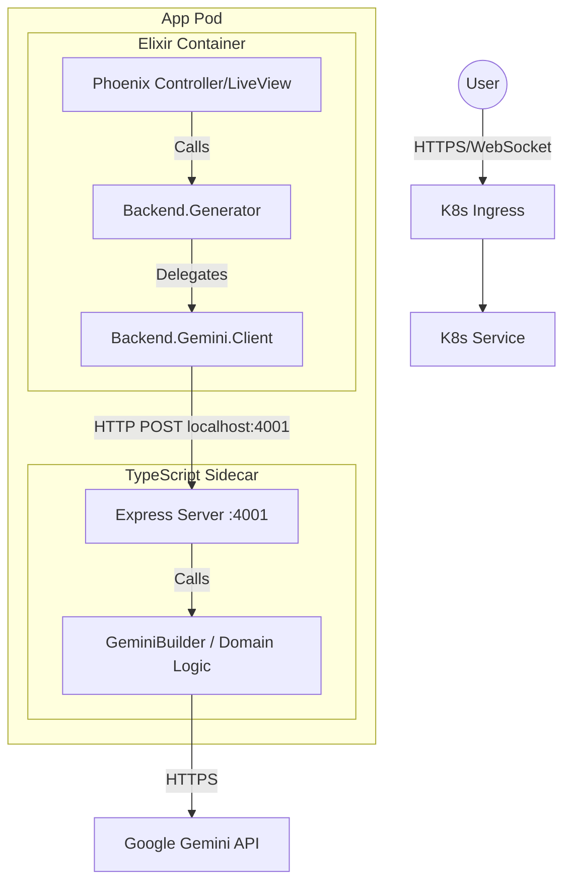
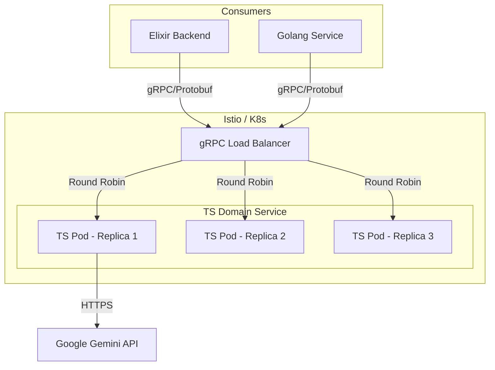

# System Architecture & Roadmap

## 1. Current Infrastructure (Sidecar Pattern)

The system follows a **Hexagonal Architecture** with a **Sidecar Deployment** model. The Elixir Gateway acts as the entry point, treating the TypeScript service as a domain adapter for "AI Logic" running in a separate container within the same Pod.

### High-Level Topology

**Sidecars**
Currently Domain part is in @src and sever.ts and deployed as a sidecar to elixir (would be if we have any(

## 3. Target Architecture (Microservices & Polyglot) - Propozed

To support multiple consumers (Elixir, Golang) and centralized domain logic, we will evolve from Sidecars to a **Centralized Microservice** architecture.

### Target Topology (Istio/RPC)

### Infrastructure Decisions
1.  **Monorepo Strategy (Nx)**:
    *   All services (Elixir, TS, Go) and the Shared Libs (`.proto`) will be managed in a single **Nx Monorepo**.
    *   *Benefit*: Atomic commits for `.proto` changes and their generated code in all languages.
2.  **Service Communication**:
    *   **Protocol**: RPC (Protobuf) for type-safe, high-performance internal calls.
    *   **Routing**: Istio (or similar Service Mesh) to handle gRPC Load Balancing (L7) and "Emit vs Broadcast" patterns.
    *   *Goal*: Elixir & Go clients treat the TS Service as a "Virtual IP", while Istio handles the complex long-lived connection balancing. (maybe, lol)

---

## 4. Consolidated Roadmap

### Phase 1: Foundation (Current)
- [x] Establish Sidecar Pattern (Elixir -> TS).
- [ ] Stabilize HTTP Interface.

### Phase 2: Standardization (Critical)
- [ ] **Adopt Nx**: Restructure repo to host Elixir, TS, and future Go apps.
- [ ] **Define RPC Contracts**: Create `packages/protos` with `gemini.proto`.
- [ ] **Implement RPC**:
    -   Migrate TS Sidecar to a RPC Server.
    -   Generate Elixir client stubs.
- [ ] Document adapter lifecycle and compatibility when core interface changes (versioned ports, dual-run v1/v2).
- [ ] Add Redis cache layer configuration to adapter settings (write-through, TTL, invalidation events).
- [ ] Add messaging adapters (NATS/Kafka) for pub/sub, broadcast, and command/event patterns.
- [ ] Add Go client adapter alongside Elixir client to consume shared contract.
- [ ] Clarify operational runbooks: `pnpm start` currently broken; use `npx tsx src/server.ts` to start the TS domain server until fixed.

### Phase 3: Scaling & Polyglot
- [ ] **Deploy Centralized Service**: Move TS out of the Pod into a standalone Deployment.
- [ ] **Add Golang Service**: Create the new Go client consuming the same gRPC contract.
    -   L2: Distributed Redis (Write-Through).

---

## 5. Risks & Prototype Assumptions

Since we are prototyping a high-scale architecture ("Google Scale"), we accept specific trade-offs:

### Accepted Complexity
*   **The Triangle of Pain**: Changing a domain field requires updates in 3 places (Proto, Server, Client).
*   **Network Fallacy**: We assume low-latency internal networking, but must handle partial failures (timeouts/retries) from Day 1.
*   **Load Balancing**: We assume an L7 Load Balancer (Istio/Linkerd) will be present in Production to handle gRPC persistent connections.

### Assumption: Statelessness
*   The **TS Domain Service** is strictly stateless. All "Memory" must be passed in (via Request History) or retrieved from a fast L2 Cache (Redis) by the Service itself. Or it will have a different call to Gemini with Context Cache on (out of scope)

### Assumption: Cache Coherence
*   We rely on **Write-Through** caching. The DB is the archive; Redis is the source of truth for active sessions. We accept the risk of cache invalidation bugs during the prototype phase. - DB is the ultimate archive, **Inser chosen cache impl for active session** - decide later. 
